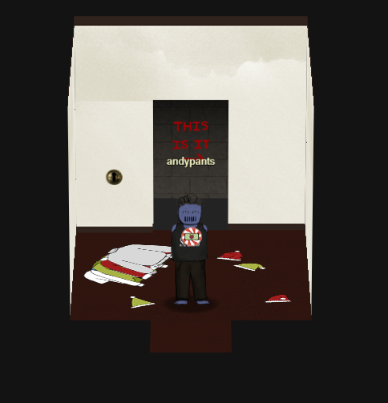

# SANS Christmas Challenge 2019
- Register for Kringle-Con by going to their website and clicking on the top right corner on Past Challengese then scroll down
  and click on challange under 2019 then scroll down and click on teh ticket. it will take you to registration page.
- Once you register you will start the game from train station and will be presented with the screen where there is a character(user) and Santa.

- Once, logged in talk to Santa by clicking on it 
Santa Says:

(make sure to read eveyrthing carefully and even twice sometimes when neeeded)

- 

**Objective 5:**

**Windows Log Analysis: Determine Compromised System**

We need to identify an infected system using Zeek logs.

The first thing that must be done is to download &#39;elfu-zeeklogs.zip.&#39; Then the file needs to be unzipped.

Open &#39;elfu-zeeklogs&#39; and then the ELFU folder. Next, open index.html.

Click on ELFU

We notice that this browser is using RITA to analyze the Zeek log files. 

**What is RITA?**

RITA (Real Intelligence Threat Analytics) is an open source tool that helps you identify compromised systems on your network. RITA performs many security checks, but the one that we are interested in is beacon analysis.

**What is Beaconing?**

Beaconing is the practice of sending short and regular communications from an infected host to an attacker-controlled host to communicate that the infected host malware is alive, functioning, and ready for instructions. It is one of the first network-related indications of a botnet or a peer-to-peer malware infection. Typically after malware gets a foothold on a host it quickly determines the host environment and calls out to its Command and Control infrastructure.

On the browser click Beacon analysis

RITA breaks out the analysis based on sets of IP addresses. All communications are inspected for repeating intervals and even attempts to skew the results.

The first column is labeled &quot;Score.&quot; The score ranges from 0-1 on the likelihood of communications between the two systems being a beacon. If you look closely at the first line, you&#39;ll see that the score is .998 between IP addresses 192.168.134.130 and 144.202.46.214. This is almost a perfect 1.0 score, so this is clearly beacon behavior.

Entering the IP address 192.168.134.130 completes the objective

**Application:**

In the wild, an organization using a tool like RITA can alert you to beaconing. Once the system is analyzed and confirmed to be infected, the incident response team can swiftly move on to the containment, eradication, and recovery phase. A quick response can help mitigate the damage the malware has done or intends to do.

**Objective 7:**

**Get Access To The Steam Tunnels**

In order to get to the steam tunnels we need to go to the dorm. Inside the dorms we see Krumpus go into the room on the far right. We follow him into the room and notice a poster of Albert Einstein on the wall. Krumpus pauses and then goes through another door. The door is locked but there is a Schlage key hole.

We noticed that before Krumpus went through the lock door he paused and we saw that he had a key hanging from his belt. We can guess that that is the key needed to unlock the door. Going back into the previous room with the poster on the wall we see a key cutting (bitting) machine. It looks like we can make a copy of Krumpus&#39; key but we need to get the key from him first.

At this point we open the console and click on the Talks category and click on Optical Decoding of Keys by Deviant Ollam. He states, &quot;It is possible to use a photograph of a key to reverse-engineer out the bitting data, a series of numbers that can be used to produce a copy, even if you never have the source key in your physical possession.&quot;

We now know that we can get the bitting values to enter into the cutting machine by comparing the key to the chart Deviant Ollam has posted on his GitHub. [https://github.com/deviantollam/decoding/blob/master/Key%20Decoding/Decoding%20-%20Schlage.png](https://github.com/deviantollam/decoding/blob/master/Key%20Decoding/Decoding%20-%20Schlage.png)

Going back into the first room we then need to use the web browser dev tools. Click the inspect element and then look for the image files. In the images folder you need to navigate to krampus.png. Save the file so we can get the key values.

After saving the image you need to use the template to get the values.

After messing around with the template and picture of the key we can see the key values

Enter the values in the bitting machine and press cut. 

Once the key is done click on the key to download it.

In the next room click on the hanging keys and use the downloaded file (key) to get through the door.

Walk through the door and at the end of the hall you&#39;ll see Krampus. When you click on him he tells you his full name. Krampus Hollyfeld.

Entering his name into the field in the objective completes the challenge.
