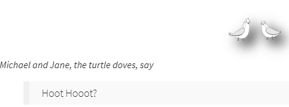

# SANS Christmas Challenge 2019
- Register for Kringle-Con by going to their website and clicking on the top right corner on Past Challengese then scroll down
  and click on challange under 2019 then scroll down and click on teh ticket. it will take you to registration page.
- Once you register you will start the game from train station and will be presented with the screen where there is a character(user) and Santa.

- Once, logged in talk to Santa by clicking on it 
Santa Says:

- (make sure to read eveyrthing carefully and even twice sometimes when neeeded)
-  There is a map of kringle con that will help you navigate the campus easily and  can be accessed via clicking on the link below. https://media.salaheldin.online/images/map.original.jpg
## Objective 0 - Talk To Santa
- The first objective starts by going to the area name 'The Quad' where you meet Santa and talk to him. once finish talking to Santa, you will be finishing up the objective 0 and more objectives will open.
- Santa Says:

- Santa needs our help and wants us to find the missing turtle doves. The point of this objective is wander around getting familiar with the ELF U. Santa also mentioned to come back to him once done with the objectives.
- Santa mentions a badge on the player's chest which looks like a circle and upon clicking  it has all the objectives and much more.

## objective 1 - Find the Turtle Doves
- Wander around a little bit, google how turtle doves look like and you will find them in the Student union building next to the fire place.

### For more objectives click on the badge and then objectives

## Objective 2 - Unredact Threatening Document
- This objective comes with instructions that are below
- Someone sent a threatening letter to Elf University. What is the first word in ALL CAPS in the subject line of the letter? Please find the letter in the Quad.
- First we have to find the letter.
- After wandering for few minutes I found it hiding in the corner of the Quad.

- click on the letter and it will open it up in the pdf.

- Now we are only concerned about the messages written in all capital letters in the Subject field.
## Objective 3 - Windows Log Analysis: Evaluate Attack Outcome

### We're given the event logs file, and tasked to find the account that was compromised using the password spray attack.
- To parse through the log file, I used Event viewer which I found online. Event Viewer is a component of Microsoft's Windows NT operating system that lets administrators and users view the event logs on a local or remote machine. Applications and operating-system components can use this centralized log service to report events that have taken place, such as a failure to start a component or to complete an action

- We are looking for the log that shows an account that was compromised by the password-spraying attack.
- Upon opening the log file in Event Log, I noticed that the Event ID 4624 shows “An Account Was Successfully Logged on”.

-  So, I filtered the log file using the event number. Reading through log entries I found 3 different account names that were compromised DC1$, supatree, pminstix. We can ignore DC1$ because that seems to be the Domain Controller.
-  Now we must find which one of these accounts were compromised by the spray attack. (sprayPassword spraying is an attack that attempts to access a large number of accounts (usernames) with a few commonly used passwords) 
-  Event ID 4625 shows failed logged in, we can use that to find out the correct compromised account. During a spray attack, if an account is compromised, it should have one less event with id 4625.

-  Once again, I filtered the log file for event Id 4624 and 4625.

-  I found the log that shows the account that was compromised by the password-spray attack.

- In this screenshot you can clearly see that all the id events are 4625 which means login attempts made by spray attack failed and after this failed attempt there is an event Id with 4624 which shows the account was successfully logged in and that account name is supatree.

## Objective 4: Windows Log Analysis: Determine Attacker Technique

- Walkthrough: SugarPlum Mary gives a clue: He mentions Sysmon and EQL. They also mention checking out a blog post about EQL by Josua WrightUpon searching I found this:
https://www.sans.org/blog/eql-threat-hunting/
- We can see the line “these normalized Sysmon logs” is underlined, and by clicking the link, we end up downloading a zip file containing the following file underneath:

- We can see here a json file for data from Sysmon. System monitor (Sysmon) is a Windows based system service and driver which remains dwelling across the machine to monitor and log system activity to the Windows event log.
- A JSON or JavaScript Object Notation, is a minimal, readable format for structuring data. After opening a file we see a bunch of text, starting from the beginning: (snippet shown below:)
    
        "command_line": "\"C:\\Windows\\system32\\wevtutil.exe\" cl Microsoft-Windows-SmbClient/Security",
        "event_type": "process",
        "logon_id": 152809,
        "parent_process_name": "?",
        "parent_process_path": "?",
        "pid": 2920,
        "ppid": 548,
        "process_name": "wevtutil.exe",
        "process_path": "C:\\Windows\\System32\\wevtutil.exe",
       
- According to this, we can see that a command to open up wevtutil.exe has been initiated and certain categories such as process id’s, logon-id’s and the process path is being shown as well. 

- Here we can see a breakdown of the elements in relation to the text above: 
To read more info, the following link can be clicked on: 
“https://jpcertcc.github.io/ToolAnalysisResultSheet/details/ntdsutil.htm”
- All that is being shown is activity which is going on within a system. The question states we must analyze the lsass.exe process. The lsass.exe file is permanently located in the \Windows\System32\ folder and is used to enforce security policies, meaning that it’s involved with things like password changes and login verifications. More information on this file can be found at: “https://en.wikipedia.org/wiki/Local_Security_Authority_Subsystem_Service”
- Instead of manually having to dig through the text file, we can just do a sequential type search on notepad or any other text editor to get us to where lsass.exe is being initiated. The process goes as:
- Open the text file using the text editor of your choice, hit ‘CTRL + F’ and search for:

- You will then be directed to where the tool is being used and we can see that:
    
     "command_line": "C:\\Windows\\system32\\cmd.exe",
        "event_type": "process",
        "logon_id": 999,
        "parent_process_name": "lsass.exe",
        "parent_process_path": "C:\\Windows\\System32\\lsass.exe",
        "pid": 3440,
        "ppid": 632,
        "process_name": "cmd.exe",
        "process_path": "C:\\Windows\\System32\\cmd.exe",
        "subtype": "create",
        "timestamp": 132186398356220000,
        "unique_pid": "{7431d376-dedb-5dd3-0000-001027be4f00}",
        "unique_ppid": "{7431d376-cd7f-5dd3-0000-001013920000}",
        "user": "NT AUTHORITY\\SYSTEM",
        "user_domain": "NT AUTHORITY",
        "user_name": "SYSTEM"
    
- A process is made to use lsass.exe . Another interesting thing we can see is that the User is now NT AUTHORITY\\SYSTEM , which we can understand through Red Team knowledge that this user has received an admin shell. Further reading on, we can see another set of text which follows: 

    "command_line": "ntdsutil.exe  \"ac i ntds\" ifm \"create full c:\\hive\" q q",
        "event_type": "process",
        "logon_id": 999,
        "parent_process_name": "cmd.exe",
        "parent_process_path": "C:\\Windows\\System32\\cmd.exe",
        "pid": 3556,
        "ppid": 3440,
        "process_name": "ntdsutil.exe",
        "process_path": "C:\\Windows\\System32\\ntdsutil.exe",
        "subtype": "create",
        "timestamp": 132186398470300000,
        "unique_pid": "{7431d376-dee7-5dd3-0000-0010f0c44f00}",
        "unique_ppid": "{7431d376-dedb-5dd3-0000-001027be4f00}",
        "user": "NT AUTHORITY\\SYSTEM",
        "user_domain": "NT AUTHORITY",
        "user_name": "SYSTEM"
    
- We see that a process for ntdsutil.exe has been created. Ntdsutil.exe, according to a Microsoft based document,  is a command-line tool that provides management facilities for Active Directory Domain Services (AD DS) and Active Directory Lightweight Directory Services (AD LDS). You can use the ntdsutil commands to perform database maintenance of AD DS, manage and control single master operations, and remove metadata left behind by domain controllers that were removed from the network without being properly uninstalled.
- What this basically means is that this tool is meant to be used by experienced administrator users to view highly important or confidential information within a system.
From the above text, "command_line": "ntdsutil.exe  \"ac i ntds\" ifm \"create full c:\\hive\" q q" , this is prompting the system to collect and dump passwords/hashes.
- “ac i ntds”, meaning to -collect instances found.
- “ifm”, meaning to Creates installation media for writable (full) and read-on
ly domain controllers (RODCs) and instances of AD LDS.
- “create”, create location to store content
- “q” , to quit
- Proof is within this website which shows how to collect and dump passwords/hashes using ntdsutil.exe:
“https://isc.sans.edu/forums/diary/Cracking+AD+Domain+Passwords+Password+Assessments+Part+1+Collecting+Hashes/23383/”
- This shows the commands in action, and for more information on ntdsutil.exe, you may visit:
”https://docs.microsoft.com/en-us/previous-versions/windows/it-pro/windows-server-2012-r2-and-2012/cc753343(v=ws.11)”
- In conclusion, we can confidently state that ntdsutil.exe is the tool the attacker used to retrieve domain password hashes from the lsass.exe process.  
# Answer: ntdsutil
## Objective 5: Windows Log Analysis: Determine Compromised System

- We need to identify an infected system using Zeek logs.
- The first thing that must be done is to download &#39;elfu-zeeklogs.zip.&#39; Then the file needs to be unzipped.
- Open &#39;elfu-zeeklogs&#39; and then the ELFU folder. Next, open index.html.

- Click on ELFU

- We notice that this browser is using RITA to analyze the Zeek log files. 
### What is RITA?
- RITA (Real Intelligence Threat Analytics) is an open source tool that helps you identify compromised systems on your network. RITA performs many security checks, but the one that we are interested in is beacon analysis.
### What is Beaconing?
- Beaconing is the practice of sending short and regular communications from an infected host to an attacker-controlled host to communicate that the infected host malware is alive, functioning, and ready for instructions. It is one of the first network-related indications of a botnet or a peer-to-peer malware infection. Typically after malware gets a foothold on a host it quickly determines the host environment and calls out to its Command and Control infrastructure.
- On the browser click Beacon analysis

- RITA breaks out the analysis based on sets of IP addresses. All communications are inspected for repeating intervals and even attempts to skew the results.
- The first column is labeled &quot;Score.&quot; The score ranges from 0-1 on the likelihood of communications between the two systems being a beacon. If you look closely at the first line, you&#39;ll see that the score is .998 between IP addresses 192.168.134.130 and 144.202.46.214. This is almost a perfect 1.0 score, so this is clearly beacon behavior.

- Entering the IP address 192.168.134.130 completes the objective
### Application:
- In the wild, an organization using a tool like RITA can alert you to beaconing. Once the system is analyzed and confirmed to be infected, the incident response team can swiftly move on to the containment, eradication, and recovery phase. A quick response can help mitigate the damage the malware has done or intends to do.
# Objective 6: Splunk

### To do this challenge we have to login in the above given link using elf and elfsocks as a password.
- Upon logging in we are presented with 7 training questions and one challenge question. There is a window on the left where it seems like security experts of ELF U are chatting about the logs.
### Training # 1:
- In the chat Kent directed me to the ELFU SOC chat group where I found the answer from Alice.

- Inserting the sweetums in the training answer 1 will reveal if it's correct.

### Training # 2:
- While reading the chat Alice tells us that “Well he is and the adversaries know it. They are always attacking him and the Elf U network trying to get to Santa”.
- So, I jumped on the splunk and started my search by typing Santa. 11 events showed up and I went through all the logs. Only the 1st and 2nd log stood out to me. 

- In the above screenshot of the 2nd event we can see the attacker is listing out the files and recursively searching for anything that has Santa in it. 
- Event # 1 shows an "Out-String" variable which means the attacker is reading the file, while it also shows us the path of the file.

### Training # 3:
- We are looking for FQDN(fully qualified domain name) that was used to command and control the powershell. I searched for sourcetype=”XmlWinEventLog:Microsoft-Windows-Sysmon/Operational”
- The following is an example of Splunk collected data. Windows event log format is 	
- On the left side we can click dest_host and find the FQDN as 144.202.46.214.vultr.com

### Training # 4: looking for the document that is used to launch the powershell code.
- Let's start our search by viewing all the powershell logs by searching for “index=main sourcetype="WinEventLog:Microsoft-Windows-Powershell/Operational" we are looking for process ID or process GUID associated with these powershell logs. We need to pivot to time in order to get that info. First reverse the event by piping with reverse.
- “index=main sourcetype="WinEventLog:Microsoft-Windows-Powershell/Operational" | reverse”
- Look at the Time column in your search results. If you click on the date/timestamp from that first event, you can specify a time window. Accept the default of +/- five seconds and click apply. Then remove the sourcetype search term and also remove the '| reverse' and re-run the search.

- We found 2 ProcessID’s

- Lets use these Id’s in the search to see what these did during the attack.
- “EventCode=4688 0x187C” With this search I'm looking for the eventcode which is windows executable and the hex of the ID 6268.

- This ID shows a process command line that launched an executable named WINWORD.EXE Upon searching I found that is the executable file name for Microsoft Word which is used when Word is launched. 
- The Microsoft word file is in the 2nd event, 1st event only shows the program that was used to open that file.

### Training # 5:looking for a number of unique email addresses that were used to send holiday cheer essays to professor Banas.
- The search query i used to find the answer is:
- index=main sourcetype=stoq | table _time 
- results{}.workers.smtp.to 
- results{}.workers.smtp.from  
- results{}.workers.smtp.subject 
- results{}.workers.smtp.body | search 
- results{}.workers.smtp.subject="Holiday Cheer 
- Assignment Submission
- The search outputs 21 results 

### Training #6: looking for the password of the zip file that was sent to professor Banas.
- I have used this search to query the email that has the password to open the zip file.
- sourcetype=stoq(results{}.workers.smtp.to="*carl.banas@faculty.elfu.org*" results{}.workers.smtp.body=*password* | table _time results{}.workers.smtp.body
- Breakout of the search parameter: stoq: stoQ is an automation framework that helps to simplify the mundane and repetitive tasks an analyst is required to do.
- Then I used the professor's email body for passwords. It will show us all the emails sent to the professor that has a word password in the body of text.

### Training # 7: We are looking for the email that was used to send a suspicious zip file to the professor. I modified the same search results that were used to find the password.
- sourcetype=stoq 
results{}.workers.smtp.to="*carl.banas@faculty.elfu.org*" 
results{}.workers.smtp.body=*password* 
| table _time results{}.workers.smtp.from results{}.workers.smtp.body

- The last line pipes the table into time column, mail coming from column and the body of the email.

### Now the challenge question: What was the message for Kent that the adversary embedded in this attack?
- We are provided with a search result link of splunk and another link to the file archive. Lets go to the splunk and see if we can find that docx file.
- Splunk search:
- index=main sourcetype=stoq  "results{}.workers.smtp.from"="bradly buttercups <bradly.buttercups@eifu.org>"
| eval results = spath(_raw, "results{}") 
| mvexpand results
| eval path=spath(results, "archivers.filedir.path"), filename=spath(results, "payload_meta.extra_data.filename"), fullpath=path."/".filename 
| search fullpath!="" 
| table filename,fullpath
- We are searching in the stoQ artifacts for the file coming from bradly buttercups.
- We find the path in the splunk events 

- Lets take the path and insert it into the file archive link

- Clicked on the file and saved it. I tried and was unable to open it. Took the file into kali linux and cat it to see.

- There is a message in that file but it is not for kent. The last part of the message tells us about the file that we are looking for which is the core.xml. Let's go find the path for core.xml and then put it in the link of the file archive. It's the last event in the splunk results.
- Downloaded the file and opened it in the linux terminal.

- Ther message in there for kent says: Kent you are so unfair. And we were going to make you the king of the Winter Carnival.

## Objective 7: Get Access To The Steam Tunnels

- In order to get to the steam tunnels we need to go to the dorm. Inside the dorms we see Krumpus go into the room on the far right. We follow him into the room and notice a poster of Albert Einstein on the wall. Krumpus pauses and then goes through another door. The door is locked but there is a Schlage key hole.

- We noticed that before Krumpus went through the lock door he paused and we saw that he had a key hanging from his belt. We can guess that that is the key needed to unlock the door. Going back into the previous room with the poster on the wall we see a key cutting (bitting) machine. It looks like we can make a copy of Krumpus&#39; key but we need to get the key from him first.
- At this point we open the console and click on the Talks category and click on Optical Decoding of Keys by Deviant Ollam. He states, &quot;It is possible to use a photograph of a key to reverse-engineer out the bitting data, a series of numbers that can be used to produce a copy, even if you never have the source key in your physical possession.&quot;
- We now know that we can get the bitting values to enter into the cutting machine by comparing the key to the chart Deviant Ollam has posted on his GitHub. [https://github.com/deviantollam/decoding/blob/master/Key%20Decoding/Decoding%20-%20Schlage.png](https://github.com/deviantollam/decoding/blob/master/Key%20Decoding/Decoding%20-%20Schlage.png)
- Going back into the first room we then need to use the web browser dev tools. Click the inspect element and then look for the image files. In the images folder you need to navigate to krampus.png. Save the file so we can get the key values.

- After saving the image you need to use the template to get the values

- After messing around with the template and picture of the key we can see the key values

- Enter the values in the bitting machine and press cut. 

- Once the key is done click on the key to download it.
- In the next room click on the hanging keys and use the downloaded file (key) to get through the door.

- Walk through the door and at the end of the hall you&#39;ll see Krampus. When you click on him he tells you his full name. Krampus Hollyfeld.

- Entering his name into the field in the objective completes the challenge.
## Objective 8: Bypassing the Frido Sleigh CAPTEHA

- Walkthrough: Underlined within the objective is Frido Sleigh Contest and upon clicking the link we are taken to the fill out form page for the contest, embedded with a CAPTCHA challenge. Snippets are shown below:

- The captcha requires us to select the images they ask for within a time set of 5 seconds which is completely impossible. The hint within the objective states to go and visit Alabaster Snowball in the speaker unpreparedness room. 

- Apparently Alabaster Snowball is having trouble with his terminal and is stuck in a different shell rather than it being bash, so we must help him out. Click on the Nyan shell next to Mr. Snowball.

- following the instructions within the terminal we get:

- We can clearly see this isn’t his normal terminal and he definitely has some explaining to do. Let’s open the Nyan terminal again and let’s try using cat etc/passwd - to show attributes for users on the machine, focusing to see what shell is linked to users:

- At the bottom we can see that nsh is set as the shell and not bash. We can look at the properties of the shell using ls -al /bin/nsh. Assuming we have permissions to edit /bin/nsh and copy over to /bin/nsh, we can easily allow Mr. Snowball to get his shell back. Let’s see:

- It seems that /bin/nsh is rewritable and an attempt to copy over /bin/bash to /bin/nsh, we get an error. We have to dig deeper, and by using ‘lsattr’, which is an extended version of viewing file attributes, and in this case we see that the letter ‘i’ appears. This means that the file is ‘IMMUTABLE’ meaning the file may not be tampered with. So, let’s just check to see what we can do with root permissions by running sudo -l.

- We are able to use “chattr”, a change attribute command, and what we can do is removed the immutable symbol on /bin/nsh and try copying over the actual shell and replace it with bash instead. We can run sudo chattr -i /bin/nsh , which removes the immutable flag, then use cp /bin/bash /bin/sh to copy over the right shell. After, we should be able to successfully login. We then continue onwards to talking with alabaster, and he reminds us about that CAPTEHA challenge earlier explained. 

- Apparently there are some references we can look at in order for us to complete the challenge. By clicking on your avatar, then clicking on Hints->Machine Learning you will be directed to this link, https://www.youtube.com/watch?v=jmVPLwjm_zs , this link refers back to the video to learn about machine learning use cases within cyber security and within the video there is a github repo which relates back to the challenge. https://github.com/chrisjd20/img_rec_tf_ml_demo , is the github link which we will use for the challenge. After watching the demo, we can see how we can use a set of images to train a machine learning setup and ultimately use to identify other images.

- Above are the files found within the repo /img_rec_tf_ml_demo. Since there is a foundation of resources, let’s see if we can find more hints. 

- Since Krampus gave us a heads up on the contest, let’s go and speak with him to see what else he can say. 
- He gives us two links he would like us to work with:

- Clicking those two underlined links, allows us to download files, 12k images associated with an API interface he is building. We get a zip folder as a well as a python file, and unzipping the folder we see folders split show categories, the same as the CAPTEHA challenge. 

- We will use this with the script provided within the github repo. Before that let’s see how the api module works for the capetha request by visiting, “fridosleigh.com/api/capteha/request

- API stands for Application Programming Interface which is a set of functions and procedures allowing the creation of applications that access the features or data of an operating system, application, or other service. What we see is BASE64 encoded image information along with UUID’s for those images. Our job is to submit the right images which correspond with the encoded images in order to succesfully complete the CAPTEHA challenge. It is now our job to update the code for python file capteha_api.py
- The following code snippets are in order and will be added to the python file.
### url = "https://fridosleigh.com/"
    # Create session
    s = requests.Session()

    # Get CAPTEHA images and types
    r = s.post(f'{url}api/capteha/request')
    if (r.json()['request']):
      images = r.json()['images']
      types = [x.strip() for x in r.json()['select_type'].split(',')]
      types[-1] = types[-1].replace('and ', '')
- For this section of code, We first have to Request a CAPTEHA, store the image data, and parse out the image types we need to select for the challenege.
### Can use queues and threading to speed up the processing
    q = queue.Queue()
### Going to iterate over each of our images.
    for image in images:
      img_uuid = image['uuid']
      img_base64 = image['base64']
      print('Processing Image {}'.format(img_uuid))
### We don't want to process too many images at once. 10 threads max
    while len(threading.enumerate()) > 10:
        time.sleep(0.0001)
### Predict_image function is expecting png image bytes so we read
### image as 'rb' to get a bytes object
    image_bytes = base64.b64decode(img_base64)
    threading.Thread(
        target=predict_image,
        args=(
            q,
            sess,
            graph,
            image_bytes,
            img_uuid,
            labels,
            input_operation,
            output_operation
        )
    ).start()
    print('Waiting For Threads to Finish...')
    while q.qsize() < len(images):
      time.sleep(0.001)
    # Getting a list of all threads returned results
    prediction_results = [q.get() for x in range(q.qsize())]

### For this set of code, we iterate over the images and for each image extract the UUID. UUID stands for “UNIVERSALLY UNIQUE IDENTIFIER”, which is a 128-bit number used to uniquely identify a type of object or entity within the internet. Next we have to convert the BASE64 image data to binary, since machine language is in binary and uses both as input to process and predict the image. We then must wait for all processing to finish (i.e. the queue size matches the number of images) and create a list containing the final prediction results.

    answers = []

    # What are we looking for?
    print(f'Looking for {types}')

    # Get the matching images
    for prediction in prediction_results:
      if prediction['prediction'] in types:
         print(f"{prediction['img_uuid']} is a {prediction['prediction']}.")
         answers.append(prediction['img_uuid'])

    final_answer = ','.join(answers)
    
    
    
    

- Finally for this last piece of code, it gets looped over the prediction results and, if an image matches a requested type, add its UUID to the answer list. The rest of the untouched code from the original python file stays in place, only with the exception of changing the email within user info to retrieve the code. 

- After running the code you end up getting a message at the end of the program stating that the code has been sent to your email. Upon checking your email you can see that the code you receive is:
## Answer: 8Ia8LiZEwvyZr2WO

